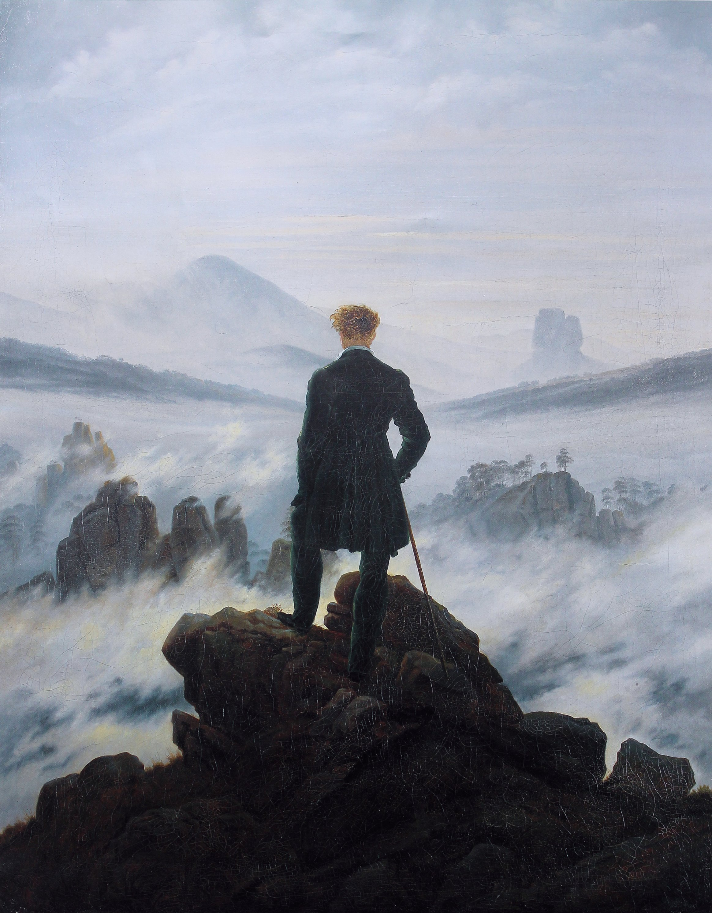
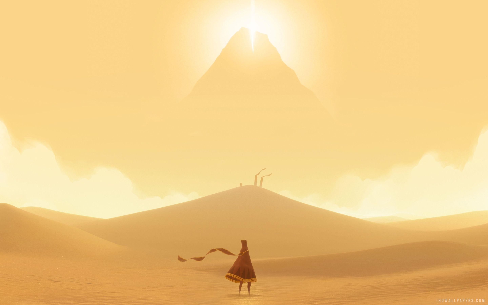

# pensamiento-computacional
ejercicios y entregas de pensamiento computacional

## primer ejercicio de codigo 

**negrita**
*italica*

- eto
- e
- una
- lita

https://editor.p5js.org/aquiles.rau/sketches/vT9dt2wAb

# **Solemne 02 / Blinding Journey**

Hecho por Aquiles Rau

Pensamiento Computacional |  22/05/2026

# DESCRIPCIÓN OBJETIVA

Se nos presenta una pieza de arte interactivo, el cual cuenta con un estilo minimalista inspirado en el viedojuego de explortacion "Journey", se trata de una composicion donde podemos observar un vasto entorno desértico compuesto por capas de dunas y montañas geométricas con tonos de tierra rojizos, donde una silueta con tunicas rojas da la espla al espectador observando el horizonte. En el centro superior destaca un sol resplandeciente la cual reposa sobre una imponente montaña que cubre gran parte del cielo. La posición Y del mouse cambia la tonalidad del cielo y de las nubes haciendo que estas transicionen cromáticamente, simulando el paso del día a la tarde, al mismo tiempo que altera la altura de las dos esferas que componen el sol.

El input presenta una accion que hace que al acercar el cursor a la cima de la montaña principal, generando como output un destello estelar de cuatro puntas que se expande de manera proporcional a la distancia del mouse, al igual que el cambio del color en su ambiente pasando de colores calidos a unos frios.

# DESCRIPCIÓN CONCEPTUAL

Blinding Journey busca explorar el concepto del "Viaje y Deseado Destino", dejando al que la atmósfera sea alterar por el usuario mediante una interacción pero continua. Es fuertemente la presencia del arte generativo y el minimalismo, ya que, al igual que su inspiracion (Journey), la obra renuncia al detalle realista y reduce el paisaje a vectores limpios, enfocandose un el uso plano del color y polígonos puros para crear un espacio que se sienta extenso.

Se utilizaron repeticiones de patrones poligonales y proporciones basadas en la escala del espacio, trabajando con la relación de tamaño entre la inmensidad del entorno y la pequeñez del individuo, creando una relacion con el usuario donde no controla al personaje, sino que altera las condiciones del mundo que este habita.

# REFERENTES

### Caminante sobre el mar de nubes

Hecha en 1818 por Caspar David Friedrich, esta obra del Romanticismo sirvió como referente para abordar de mejor manera el concepto de un paisaje sublime, donde figuras solitarias contemplan la inmensidad de la naturaleza para evocar introspección y asombro en el espectador.

### Journey

El juergo "Journey" fue desarrollado en 2012 por *Thatgamecompany* y dirigido por Jenova Chen, es el referente directo del proyecto. Su dirección de arte inspiró la paleta cromática desértica, el diseño de la silueta del personaje con túnica y la presencia magnética de una montaña luminosa en el horizonte que funciona como foco de atencion de manera constante.

# INPUTS, OUTPUTS, SISTEMA

(https://editor.p5js.org/aquiles.rau/sketches/vT9dt2wAb)

### Reglas del sistema

El lienzo funciona como un paisaje geométrico interactivo estructurado por capas de profundidad creadas a base de (quad y triangle). Si el cursor se mueve verticalmente, la atmósfera es alterada y pasa de un estado de atardecer cálido a uno más frío y opaco mediante interpolación de color. El sol sigue la posición del mouse en el eje Y pero está regido por dos variables de velocidad distintas (speed1 = 0.04 y speed2 = 0.70), generando un desfase visual. Finalmente, si la distancia entre el mouse y la cima es menor a 75 píxeles, el sistema activa un destello estelar que escala proporcionalmente a la cercanía.

### Modelo de interactividad

Blinding Journey tiene 2 formas de interactuar con el usuario.Lla primera es la interactividad continua que ocurre al desplazar el mouse por eje vertical, permitiendo transformar la iluminación del cielo, las nubes y la posición desfasada del sol con movimientos simples. Tambien cuenta con una interactividad que es implícita por proximidad, la cual se gatilla al acercar el cursor al destino, desencadenando una fenomeno visual que hace florecer el destello geométrico en la cima de la montaña a la par que llegue el sol a la cima.

### Flujo de datos

| Datos de Entrada (Inputs) | Procesamiento y Transformación | Respuesta Visual (Outputs) |
| ------------- |:-------------:| -----:|
| Coordenada MouseY | La función map() y lerpColor() transforman la posición de los píxeles en factores de interpolación cromática (0 a 1). | El cielo y las nubes transicionan fluidamente entre tonos cálidos y fríos. |
| Inercia del Sol (Easing) | El algoritmo calcula la distancia entre la posición actual del sol y el objetivo: y += (targetY - y)  speed. | Las dos esferas del sol se desplazan a diferentes velocidades, creando un efecto óptico de desfase. |
| Coordenadas MouseX, MouseY | La función dist() mide constantemente la distancia euclidiana entre el cursor y el punto fijo de la cima (500, 120). | Determina si el sistema debe activar o re

