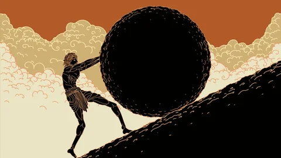

# Pensamiento-Computacional
ejercicios y entregas de pensamiento computacional

## primer ejercicio de codigo 

**negrita**
*italica*

- eto
- e
- una
- lita

https://editor.p5js.org/aquiles.rau/sketches/vT9dt2wAb

# **Solemne 02 / Blinding Journey**

Hecho por Aquiles Rau

Pensamiento Computacional |  22/05/2026

# DESCRIPCIÓN OBJETIVA

Se nos presenta una pieza de arte interactivo, el cual cuenta con un estilo minimalista inspirado en el viedojuego de explortacion "Journey", se trata de una composicion donde podemos observar un vasto entorno desértico compuesto por capas de dunas y montañas geométricas con tonos de tierra rojizos, donde una silueta con tunicas rojas da la espla al espectador observando el horizonte. En el centro superior destaca un sol resplandeciente la cual reposa sobre una imponente montaña que cubre gran parte del cielo. La posición Y del mouse cambia la tonalidad del cielo y de las nubes haciendo que estas transicionen cromáticamente, simulando el paso del día a la tarde, al mismo tiempo que altera la altura de las dos esferas que componen el sol.

El input presenta una accion que hace que al acercar el cursor a la cima de la montaña principal, generando como output un destello estelar de cuatro puntas que se expande de manera proporcional a la distancia del mouse, al igual que el cambio del color en su ambiente pasando de colores calidos a unos frios.

# DESCRIPCIÓN CONCEPTUAL

Blinding Journey busca explorar el concepto del "Viaje y Deseado Destino", dejando al que la atmósfera sea alterar por el usuario mediante una interacción pero continua. Es fuertemente la presencia del arte generativo y el minimalismo, ya que, al igual que su inspiracion (Journey), la obra renuncia al detalle realista y reduce el paisaje a vectores limpios, enfocandose un el uso plano del color y polígonos puros para crear un espacio que se sienta extenso.

Se utilizaron repeticiones de patrones poligonales y proporciones basadas en la escala del espacio, trabajando con la relación de tamaño entre la inmensidad del entorno y la pequeñez del individuo, creando una relacion con el usuario donde no controla al personaje, sino que altera las condiciones del mundo que este habita.

# REFERENTES

### Caminante sobre el mar de nubes

Hecha en 1818 por Caspar David Friedrich, esta obra del Romanticismo sirvió como referente para abordar de mejor manera el concepto de un paisaje sublime, donde figuras solitarias contemplan la inmensidad de la naturaleza para evocar introspección y asombro en el espectador.

### Journey

El juergo "Journey" fue desarrollado en 2012 por *Thatgamecompany* y dirigido por Jenova Chen, es el referente directo del proyecto. Su dirección de arte inspiró la paleta cromática desértica, el diseño de la silueta del personaje con túnica y la presencia magnética de una montaña luminosa en el horizonte que funciona como foco de atencion de manera constante.

# INPUTS, OUTPUTS, SISTEMA

(https://editor.p5js.org/aquiles.rau/sketches/vT9dt2wAb)

### Reglas del sistema

El lienzo funciona como un paisaje geométrico interactivo estructurado por capas de profundidad creadas a base de (quad y triangle). Si el cursor se mueve verticalmente, la atmósfera es alterada y pasa de un estado de atardecer cálido a uno más frío y opaco mediante interpolación de color. El sol sigue la posición del mouse en el eje Y pero está regido por dos variables de velocidad distintas (speed1 = 0.04 y speed2 = 0.70), generando un desfase visual. Finalmente, si la distancia entre el mouse y la cima es menor a 75 píxeles, el sistema activa un destello estelar que escala proporcionalmente a la cercanía.

### Modelo de interactividad

Blinding Journey tiene 2 formas de interactuar con el usuario.Lla primera es la interactividad continua que ocurre al desplazar el mouse por eje vertical, permitiendo transformar la iluminación del cielo, las nubes y la posición desfasada del sol con movimientos simples. Tambien cuenta con una interactividad que es implícita por proximidad, la cual se gatilla al acercar el cursor al destino, desencadenando una fenomeno visual que hace florecer el destello geométrico en la cima de la montaña a la par que llegue el sol a la cima.

### Flujo de datos

| Datos de Entrada (Inputs) | Procesamiento y Transformación | Respuesta Visual (Outputs) |
| ------------- |:-------------:| -----:|
| Coordenada MouseY | La función map() y lerpColor() transforman la posición de los píxeles en factores de interpolación cromática (0 a 1). | El cielo y las nubes transicionan fluidamente entre tonos cálidos y fríos. |
| Inercia del Sol (Easing) | El algoritmo calcula la distancia entre la posición actual del sol y el objetivo: y += (targetY - y)  speed. | Las dos esferas del sol se desplazan a diferentes velocidades, creando un efecto óptico de desfase. |
| Coordenadas MouseX, MouseY | La función dist() mide constantemente la distancia euclidiana entre el cursor y el punto fijo de la cima (500, 120). | Determina si el sistema debe activar o re

# Pensamiento-Computacional
Ejercicios y entregas de pensamiento computacional.

https://editor.p5js.org/aquiles.rau/sketches/NAbixNy92

# **Examen / A Long Journey (Nueva Versión)**

Hecho por Aquiles Rau  
Pensamiento Computacional | 26/06/2026

## DESCRIPCIÓN OBJETIVA

Se nos presenta una pieza de arte interactivo secuencial dividida en cinco "lienzos" o estados, inspirada en el videojuego de exploración "Journey". La obra transiciona fluidamente entre distintas atmósferas visuales, integrando medios generativos, audio y la captura en tiempo real del usuario.

El núcleo visual (Diseño Original y Monte) destaca por un vasto entorno desértico y montañoso compuesto por capas geométricas, tonos cálidos y verdosos, y patrones poligonales. En estos escenarios, el usuario altera la hora del día y la posición del sol mediante el eje Y del mouse, desencadenando destellos estelares al alcanzar ciertas cumbres. 

La experiencia está enmarcada por la presencia del usuario: inicia con un lienzo oscuro que revela sutilmente la cámara web bajo el título "EL INICIO DE UN LARGO VIAJE", y culmina en un quinto lienzo abstracto donde la captura de video del espectador se enmascara en un círculo perfecto bajo la frase "EL FIN". La navegación entre estas etapas se realiza tecleando las letras de la palabra "VIAJE", revelando en segundo plano mensajes poéticos.

## DESCRIPCIÓN CONCEPTUAL

**A Long Journey** busca explorar el concepto del "Viaje, la contemplación y el eterno retorno". En esta versión expandida, la relación entre el individuo y el entorno se hace literal al incluir al propio espectador dentro de la obra a través de la cámara web, sugiriendo que el protagonista del viaje es quien está frente a la pantalla.

La obra renuncia al detalle realista y reduce el paisaje a vectores limpios, enfocándose en el uso plano del color y la inmensidad del espacio. Al requerir que el usuario teclee las letras "V-I-A-J-E" para avanzar, se establece una interactividad rítmica. Además, el proyecto esconde un poema fragmentado en la consola del navegador; cada tecla pulsada imprime un verso que reflexiona sobre la soledad, el encuentro y el destino, premiando al usuario curioso con una capa narrativa invisible a simple vista. Al final, el viaje concluye donde empezó: con el reflejo del propio usuario.

## REFERENTES

### Caminante sobre el mar de nubes
Hecha en 1818 por Caspar David Friedrich, esta obra del Romanticismo sirvió como referente para abordar de mejor manera el concepto de un paisaje sublime, donde figuras solitarias contemplan la inmensidad de la naturaleza para evocar introspección y asombro en el espectador.

### Journey
Al igual que en la entrega anterior,el referente directo es el juego "Journey", desarrollado en 2012 por *Thatgamecompany* y dirigido por Jenova Chen, es el referente directo del proyecto. Su dirección de arte inspiró la paleta cromática desértica, el diseño minimalista y la presencia magnética de un elemento luminoso en el horizonte que funciona como foco de atención constante.

### El Mito de Sísifo
Un referente usado en una de las laminas fue el de El Mito de Sísifo, que representa el sinsentido y el esfuerzo constante de la condición humana frente a un destino inalterable, el cual se alinea especialmente con el sentimiento que busca transmitir la composicion del codigo

## INPUTS, OUTPUTS, SISTEMA

### Reglas del sistema
El programa funciona bajo una **máquina de estados** controlada por variables de estado (`INICIO`, `DISENO`, `MONTE`, `CUARTO`, `QUINTO`). El cambio entre estos estados no es abrupto; el sistema utiliza una función de renderizado centralizada con un parámetro de opacidad (`alphaGlobal`) que permite generar un efecto de *crossfade* (difuminado) controlado por la variable `fadeValue`. Las físicas y animaciones continuas (como el desplazamiento del sol o la respiración de las nubes basada en "funciones seno") solo se actualizan si su lienzo respectivo está activo y no en transición.

### Modelo de interactividad
A Long Journey cuenta con tres capas de interactividad:
1. **Continua (Mouse):** Al desplazar el cursor verticalmente, la atmósfera se altera, pasando de un atardecer cálido a uno frío mediante interpolación de color, mientras se crea un desfase óptico en los elementos del cielo gracias a variables de inercia (easing).
2. **Implícita por proximidad:** Gatillada al acercar el cursor a coordenadas específicas (la cima de la montaña), desencadenando un destello geométrico que escala proporcionalmente a la cercanía.
3. **Discreta y Narrativa (Teclado):** El uso de teclas específicas (V, I, A, J, E) actúa como gatillo para iniciar las transiciones visuales, controlar el audio y revelar la narrativa oculta en la consola del desarrollador.

### Flujo de datos

| Datos de Entrada (Inputs) | Procesamiento y Transformación | Respuesta Visual / Sonora (Outputs) |
| :--- | :--- | :--- |
| **Coordenada MouseY** | La función `map()` y `lerpColor()` transforman la posición de los píxeles en factores de interpolación cromática (0 a 1). | El cielo y las nubes transicionan fluidamente entre tonos cálidos y fríos. |
| **Inercia del Sol (Easing)** | El algoritmo calcula la distancia entre la posición actual y el objetivo: `y += (targetY - y) * speed`. | Dos esferas solares se desplazan a diferentes velocidades, creando desfase visual. |
| **Distancia (MouseX, MouseY)** | La función `dist()` mide la distancia euclidiana entre el cursor y el punto fijo de la cima. | Se activa y escala un destello estelar en la cima de la montaña principal. |
| **Teclado (Teclas V, I, A, J)** | Condicionales detectan la tecla y activan la función `iniciarCrossfade()`, asignando estados de origen y destino. | El lienzo actual se desvanece gradualmente (reduce opacidad) revelando el siguiente. |
| **Teclado (Teclas V, F)** | Eventos de presionado evalúan las teclas para disparar métodos del objeto de audio (`musica.play()` / `.pause()`). | Reproducción o pausa de la pista ambiental ("journeysound.mp3"). |
| **Teclado (Teclas V, I, A, J, E)** | Un `EventListener` en el DOM detecta la pulsación y busca la correspondencia en un diccionario de texto. | Se imprime en la consola del navegador un fragmento poético de la historia. |
| **Cámara Web (Video)** | `createCapture(VIDEO)` lee los datos del sensor y, en el último lienzo, se le aplica una máscara gráfica (`mask()`). | El usuario se ve reflejado en pantalla completa al inicio, y dentro de un círculo al final. |

